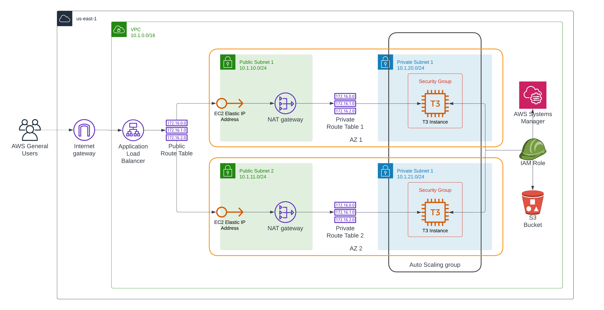

# Udacity Cloud DevOps Engineer: Project 02 - Deploy a high-availability web app using CloudFormation

## Diagram


## How to run this?

Powershell:

```powershell
# Create stacks
# ./create.bat "<stack_name>" "<stack_template_file>" "<stack_parameters_file>" "<region>"
## Network
./create.bat "stack-net" "submission/network.yml" "submission/network.parameters.json" "us-east-1"
## Server
./create.bat "stack-app" "submission/server.yml" "submission/server.parameters.json" "us-east-1"


# Update stacks
# ./update.bat "<stack_name>" "<stack_template_file>" "<stack_parameters_file>" "<region>"
## Network
./update.bat "stack-net" "submission/network.yml" "submission/network.parameters.json" "us-east-1"
## Server
./update.bat "stack-app" "submission/server.yml" "submission/server.parameters.json" "us-east-1"
```

Bash:

```bash
# Create stacks
## Network
./create.sh stack-net submission/network.yml submission/network.parameters.json us-east-1
## Server
./create.sh stack-app submission/server.yml submission/server.parameters.json us-east-1


# Update stacks
## Network
./update.sh stack-net submission/network.yml submission/network.parameters.json us-east-1
## Server
./update.sh stack-app submission/server.yml submission/server.parameters.json us-east-1
```
